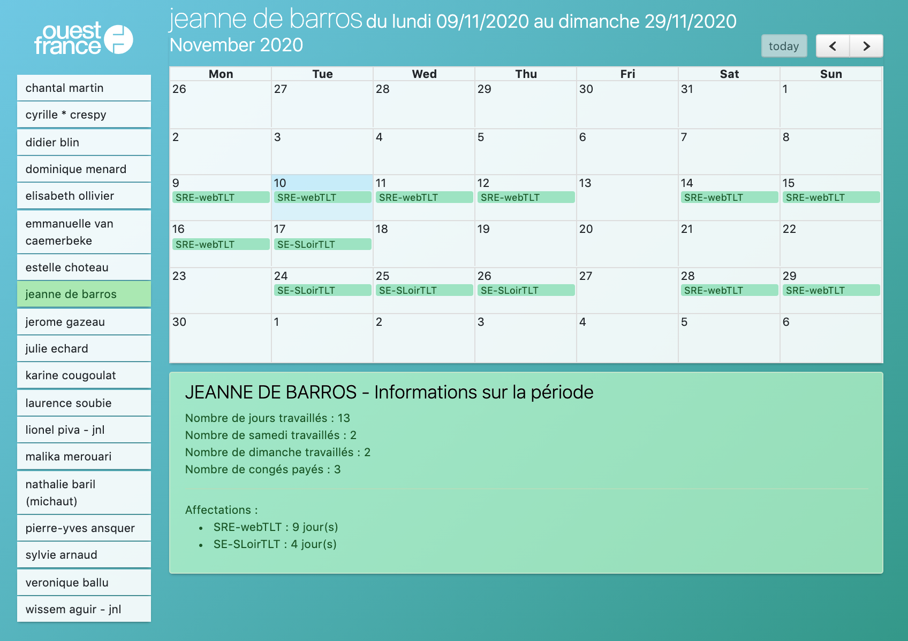

# POGA
[Bookmark pour styliser le POGA OF](https://static.trema.ovh/POGA)

# Utilisation

[Voir la page d'explication](https://static.trema.ovh/POGA), ou suivre ces étapes :

1. Séléctionnez tout le texte suivant, puis glissez-déposez ce texte dans votre barre de favoris (ou trouvez l'option "Ajouter un nouveau favori / nouvelle page", et remplissez le champ "Adresse / URL" avec ceci) :

       javascript:(function(){var head = window.document.getElementsByTagName('head')[0]; var addedHead= window.document.createElement('script'); addedHead.setAttribute('src', "https://static.trema.ovh/POGA/import.js"); addedHead.async=true; head.appendChild(addedHead);})();

2. Ensuite, consultez votre planning comme d'habitude en choisissant la période à afficher.
3. Une fois que votre planning est affiché sur votre écran (le grand tableau), cliquez sur le favori créé juste avant

# Fonctionnalités

- Cliquez sur une personne pour afficher son agenda
- Cliquez sur le "+" d'une deuxième personne pour comparer les agenda
- Déselectionnez les personnes les unes après les autres pour visualiser d'autres agendas.

# Bugs connus

- Les couleurs des plannings ne concordent pas avec la couleur de la personne sélectionnée
